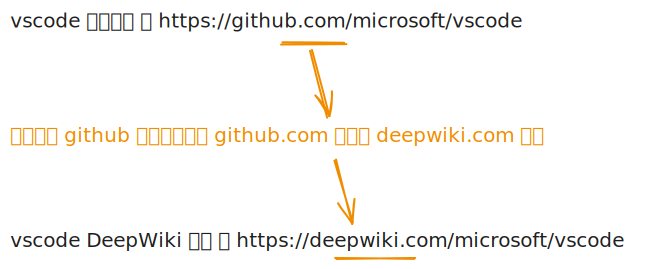

# [0007. DeepWiki](https://github.com/tnotesjs/TNotes.github/tree/main/notes/0007.%20DeepWiki)

<!-- region:toc -->

- [1. 🎯 本节内容](#1--本节内容)
- [2. 🫧 评价](#2--评价)
- [3. 🤔 DeepWiki 是什么？](#3--deepwiki-是什么)
  - [3.1. 来自 DeepWiki 官方的定义](#31-来自-deepwiki-官方的定义)
  - [3.2. DeepWiki 的使用](#32-deepwiki-的使用)
- [4. 📺 Github 的超级百科，一键可视化，光速读懂开源代码](#4--github-的超级百科一键可视化光速读懂开源代码)
- [5. 📺 DeepWiki 上线即爆火：专为 GitHub 打造的免费百科全书](#5--deepwiki-上线即爆火专为-github-打造的免费百科全书)
- [6. 🔗 引用](#6--引用)

<!-- endregion:toc -->

## 1. 🎯 本节内容

- deepwiki

## 2. 🫧 评价

DeepWiki 是很好用的一款辅助学习 Github 知名开源项目源码的工具，可谓是我目前（2025-2026 期间）阅读 github 开源项目源码的常用工具之一。

如果你还不清楚 DeepWiki 是什么，可以结合笔记中记录的两个 B 站上 1min 左右的视频快速了解一下 DeepWiki 是什么及其基本用法。

## 3. 🤔 DeepWiki 是什么？

DeepWiki 是一个 GitHub 上大部分知名开源项目的百科全书。

### 3.1. 来自 DeepWiki 官方的定义

[DeepWiki doc][2]

### 3.2. DeepWiki 的使用

使用非常简单，只需要将地址中的 `github` 改为 `deepwiki` 即可。比如：

- vscode 仓库地址：`https://github.com/microsoft/vscode`
- vscode DeepWiki 地址：`https://deepwiki.com/microsoft/vscode`

除此之外，我们也可以在 [DeepWiki 官网][3] 通过项目名称来查阅指定的 github 仓库。

## 4. 📺 Github 的超级百科，一键可视化，光速读懂开源代码

<B id="BV1K8G9z1ECk" />

## 5. 📺 DeepWiki 上线即爆火：专为 GitHub 打造的免费百科全书

<B id="BV1M3G1zdEgc" />

## 6. 🔗 引用

- [Cognition AI][1]
  - Devin 的开发公司
- [deepwiki doc][2]
- [deepwiki 官网][3]

[1]: https://cognition.ai/
[2]: https://docs.devin.ai/work-with-devin/deepwiki
[3]: https://deepwiki.org/
