```mermaid
graph TB
  %% Presentation Layer
  subgraph "Presentation Layer"
    direction TB
    Browser["Client Browser\n(React UI)"]:::frontend
    MD["Interactive Diagram Component"]:::frontend
    OC["Other React UI Components"]:::frontend
    PAGES["Next.js Pages"]:::frontend
    LAYOUT["Layout & Providers"]:::frontend

    Browser -->|renders| MD
    Browser -->|uses| OC
    Browser -->|navigates| PAGES
    PAGES -->|wraps with| LAYOUT
  end

  %% Next.js Application Layer
  subgraph "Next.js Application Layer"
    direction TB
    SA_CACHE["cache.ts"]:::frontend
    SA_GH["github.ts"]:::frontend
    SA_REPO["repo.ts"]:::frontend
    FETCH["fetch-backend.ts"]:::frontend
    DRIZZLE_CFG["drizzle.config.ts"]:::frontend
    DB_SCHEMA["DB Schema"]:::frontend
    DB_INDEX["DB Index"]:::frontend

    MD -->|onClick triggers| SA_GH
    MD -->|fetches| SA_CACHE
    SA_CACHE -->|reads/writes| DB_INDEX
    SA_GH -->|calls| FETCH
    SA_REPO -->|calls| FETCH
    FETCH -->|POST /generate, /modify| NGINX
    DRIZZLE_CFG -->|configures| POSTGRES
    DB_SCHEMA -->|defines| POSTGRES
  end

  %% API Layer
  subgraph "API Layer"
    direction TB
    NGINX["Nginx Reverse Proxy"]:::backend
    NGINX -->|forwards POST /generate, /modify| FASTAPI_MAIN
  end

  %% Backend Service Layer
  subgraph "Backend Service Layer"
    direction TB
    FASTAPI_MAIN["main.py"]:::backend
    LIMITER["Rate Limiter"]:::backend
    PROMPTS["Prompt Engineering"]:::backend
    ROUTE_GEN["Generate Diagram Router"]:::backend
    ROUTE_MOD["Modify Diagram Router"]:::backend
    SERVICE_O4["OpenAI o4-mini Service"]:::backend
    SERVICE_CLAUDE["Anthropic Claude Service"]:::backend
    SERVICE_O1["o1_mini_openai_service.py"]:::backend
    SERVICE_O3["o3_mini_openai_service.py"]:::backend
    SERVICE_OR["o3_mini_openrouter_service.py"]:::backend
    SERVICE_GH["GitHub Integration Service"]:::backend
    UTIL_FMT["Message Formatter"]:::backend

    FASTAPI_MAIN -->|includes| ROUTE_GEN
    FASTAPI_MAIN -->|includes| ROUTE_MOD
    ROUTE_GEN -->|uses limiter| LIMITER
    ROUTE_MOD -->|uses limiter| LIMITER
    ROUTE_GEN -->|calls| PROMPTS
    ROUTE_MOD -->|calls| PROMPTS
    PROMPTS -->|invokes| SERVICE_O4
    PROMPTS -->|invokes| SERVICE_CLAUDE
    PROMPTS -->|invokes| SERVICE_O1
    PROMPTS -->|invokes| SERVICE_O3
    PROMPTS -->|invokes| SERVICE_OR
    ROUTE_GEN -->|private repo| SERVICE_GH
    UTIL_FMT -->|formats for| PROMPTS
  end

  %% Data Layer
  subgraph "Data Layer"
    direction TB
    POSTGRES["PostgreSQL Database"]:::database
  end

  %% External Services
  subgraph "External Services"
    direction TB
    GitHubAPI["GitHub API"]:::external
    OpenAI["OpenAI o4-mini"]:::external
    Claude["Anthropic Claude"]:::external
    Analytics["Analytics (PostHog)"]:::external

    SERVICE_O4 -->|API call| OpenAI
    SERVICE_CLAUDE -->|API call| Claude
    SERVICE_GH -->|fetches tree| GitHubAPI
    ROUTE_GEN -->|logs usage| Analytics
  end

  %% Connections between Layers
  SA_GH -->|Server Action| NGINX
  SA_REPO -->|Server Action| NGINX
  POSTGRES <-->|reads/writes| DB_INDEX

  %% Click Events
  click MD "https://github.com/ahmedkhaleel2004/gitdiagram/blob/main/src/components/mermaid-diagram.tsx"
  click OC "https://github.com/ahmedkhaleel2004/gitdiagram/tree/main/src/components/"
  click PAGES "https://github.com/ahmedkhaleel2004/gitdiagram/blob/main/src/app/page.tsx"
  click PAGES "https://github.com/ahmedkhaleel2004/gitdiagram/blob/main/src/app/[username]/[repo]/page.tsx"
  click LAYOUT "https://github.com/ahmedkhaleel2004/gitdiagram/blob/main/src/app/layout.tsx"
  click LAYOUT "https://github.com/ahmedkhaleel2004/gitdiagram/blob/main/src/app/providers.tsx"
  click SA_CACHE "https://github.com/ahmedkhaleel2004/gitdiagram/blob/main/src/app/_actions/cache.ts"
  click SA_GH "https://github.com/ahmedkhaleel2004/gitdiagram/blob/main/src/app/_actions/github.ts"
  click SA_REPO "https://github.com/ahmedkhaleel2004/gitdiagram/blob/main/src/app/_actions/repo.ts"
  click FETCH "https://github.com/ahmedkhaleel2004/gitdiagram/blob/main/src/lib/fetch-backend.ts"
  click DRIZZLE_CFG "https://github.com/ahmedkhaleel2004/gitdiagram/blob/main/drizzle.config.ts"
  click DB_SCHEMA "https://github.com/ahmedkhaleel2004/gitdiagram/blob/main/src/server/db/schema.ts"
  click DB_INDEX "https://github.com/ahmedkhaleel2004/gitdiagram/blob/main/src/server/db/index.ts"
  click FASTAPI_MAIN "https://github.com/ahmedkhaleel2004/gitdiagram/blob/main/backend/app/main.py"
  click LIMITER "https://github.com/ahmedkhaleel2004/gitdiagram/blob/main/backend/app/core/limiter.py"
  click PROMPTS "https://github.com/ahmedkhaleel2004/gitdiagram/blob/main/backend/app/prompts.py"
  click ROUTE_GEN "https://github.com/ahmedkhaleel2004/gitdiagram/blob/main/backend/app/routers/generate.py"
  click ROUTE_MOD "https://github.com/ahmedkhaleel2004/gitdiagram/blob/main/backend/app/routers/modify.py"
  click SERVICE_O4 "https://github.com/ahmedkhaleel2004/gitdiagram/blob/main/backend/app/services/o4_mini_openai_service.py"
  click SERVICE_CLAUDE "https://github.com/ahmedkhaleel2004/gitdiagram/blob/main/backend/app/services/claude_service.py"
  click SERVICE_O1 "https://github.com/ahmedkhaleel2004/gitdiagram/blob/main/backend/app/services/o1_mini_openai_service.py"
  click SERVICE_O3 "https://github.com/ahmedkhaleel2004/gitdiagram/blob/main/backend/app/services/o3_mini_openai_service.py"
  click SERVICE_OR "https://github.com/ahmedkhaleel2004/gitdiagram/blob/main/backend/app/services/o3_mini_openrouter_service.py"
  click SERVICE_GH "https://github.com/ahmedkhaleel2004/gitdiagram/blob/main/backend/app/services/github_service.py"
  click UTIL_FMT "https://github.com/ahmedkhaleel2004/gitdiagram/blob/main/backend/app/utils/format_message.py"

  %% Styles
  classDef frontend fill:#D0E8FF,stroke:#0366d6,color:#000
  classDef backend fill:#D6F5D6,stroke:#028a0f,color:#000
  classDef database fill:#FFE4B5,stroke:#cd853f,color:#000
  classDef external fill:#E0E0E0,stroke:#666,color:#000
```

# [0009. gitdiagram](https://github.com/tnotesjs/TNotes.github/tree/main/notes/0009.%20gitdiagram)

<!-- region:toc -->

- [1. 🎯 本节内容](#1--本节内容)
- [2. 🫧 评价](#2--评价)
- [3. 🤔 gitdiagram 是什么？](#3--gitdiagram-是什么)
- [4. 📺 Github 17.4K Star！一键架构图神器！太牛了！](#4--github-174k-star一键架构图神器太牛了)
- [5. 🔗 引用](#5--引用)

<!-- endregion:toc -->

## 1. 🎯 本节内容

- todo

## 2. 🫧 评价

- gitdiagram 是一款用于生成 github 开源项目的架构图的工具，对于阅读一些知名开源项目的源码可能会有所帮助。
- 基本使用非常简单，可以结合笔记中记录的 B 站的 1min 左右的视频来了解一下它的用法。

## 3. 🤔 gitdiagram 是什么？

- [gitdiagram][2]
  - 几秒钟内将任何 GitHub 仓库转换为可视化的交互式图表。
  - 你也可以将任何 GitHub 网址中的 `github` 替换为 `gitdiagram` 来访问其图表。
- 作用
  - 可以结合 `gitdiagram` 帮我们生成的项目架构图，辅助阅读一些知名开源项目的源码。
  - 对于快速了解一个项目的大致架构可能会有所帮助。
  - 在阅读一些知名开源项目的源码时，也可以结合着 `deepwiki` 这个工具一起使用。
- [mermaid](https://github.com/ahmedkhaleel2004/gitdiagram/blob/ca88e20e1707577830a99a3177bdee4553aaaae8/package.json#L37)
  - 最终呈现的图标，是基于开源项目 mermaid 来绘制的，这个图表可以很轻松地嵌入到 markdown 中。
  - 比如，你可以利用这个工具分析一下这个项目的架构，生成 diagram 图之后，copy mermaid 代码，丢到 markdown 笔记中。
  - 
  - ⬇️ ⬇️ ⬇️ 下面展示的 mermaid 图表，就是搬运过来的结果，只不过这里搬运过来的结果的交互效果或许就没官方做的好了（比如鼠标悬停在链接块上之后，块会有放大变灰的交互效果），不过超链接依旧是正常有效的。

## 4. 📺 Github 17.4K Star！一键架构图神器！太牛了！

<B id="BV1GcEUzQE1b"></B>

## 5. 🔗 引用

- [gitdiagram github][1]
- [gitdiagram 官网][2]
- [mermaid][3]

[1]: https://github.com/ahmedkhaleel2004/gitdiagram
[2]: https://gitdiagram.com/
[3]: https://mermaid.js.org/
